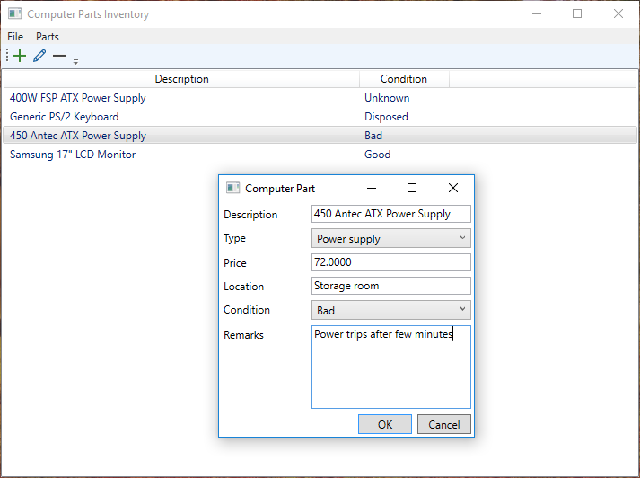

# computer-part-db

Inspired by a pile of computer parts on boxes and plastic bags, I have created this tool to help me sort, log and track the computer parts. 

This application was created on Visual Studio 2017 Community Edition with C# and WPF (Windows Presentation Foundation).

## Build 

Open Visual Studio and build the solution/project file.

## Usage

To add a computer part, click the '+' icon and fill up the form. Then, click OK. This will save the inputted data to local database file.
To edit a computer part, select an entry and click the 'pencil' icon and modify form. Then, click OK. This will update the entry on the local database file.
To delete a computer part, select an entry and click the '-' icon. Then, confirm the delete operation. This will delete the entry on the local database file.

