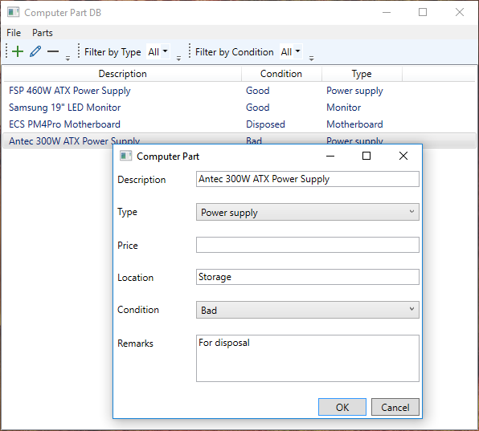
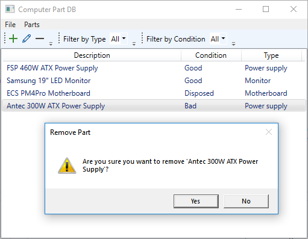
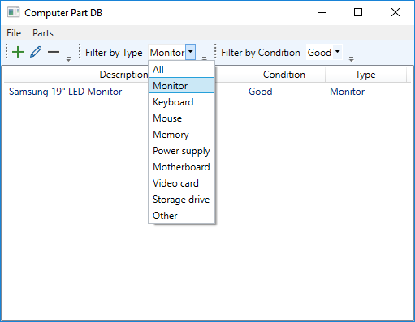

# computer-part-db

This tool is a database application that keep a list of computer parts and categorize it if it is good, bad or need to be dispose. It helps the user checks if there is an available hardware and what its condition. It avoids the situation of �I found a 400W power supply in storage room but I just bought a replacement power supply last month�.

## Build 

Open Visual Studio and build the solution/project file.

## Usage

To add a computer part, click the '+' icon and fill up the form. Then, click OK. This will save the inputted data to local database file and the list view will reflects the new item.

To edit a computer part, select an entry on the list and click the 'pencil' icon and modify the form. Then, click OK. This will update the entry on the local database file.

 

To delete a computer part, select an entry on the list and click the '-' icon. Then, confirm the delete operation. This will delete the entry on the local database file.

To see a list of computer parts by type and condition, select a specific type (example: Monitor) amd condition (example: Good). 

